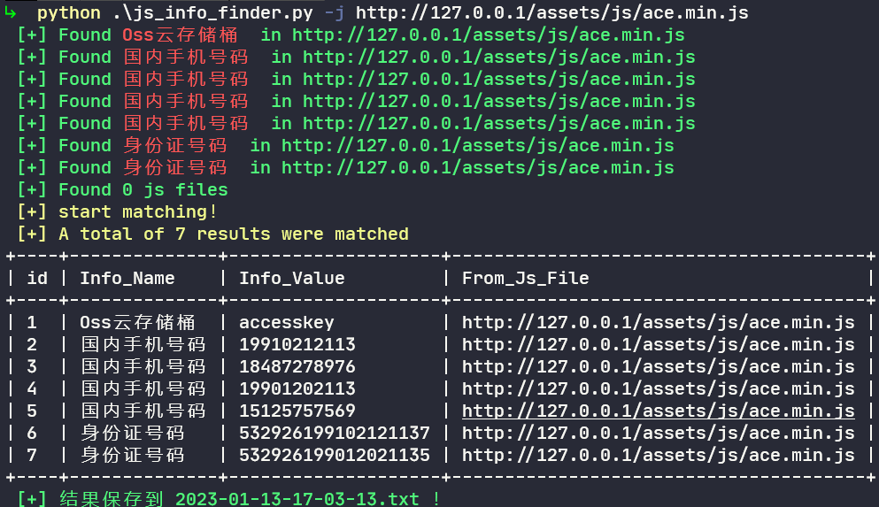

# js_info_finder
一个js文件敏感信息搜集脚本，支持输入url和js文件，也支持批量敏感信息匹配。

主要基于正则表达式来提取敏感信息，正则表达式参考以下两个项目
1. [https://github.com/m4ll0k/SecretFinder](https://github.com/m4ll0k/SecretFinder)
2. [https://github.com/System00-Security/API-Key-regex](https://github.com/System00-Security/API-Key-regex)

有几项正则表达式误报比较多，可以根据自己的需要删除或增加相关的匹配项。

**实例**

